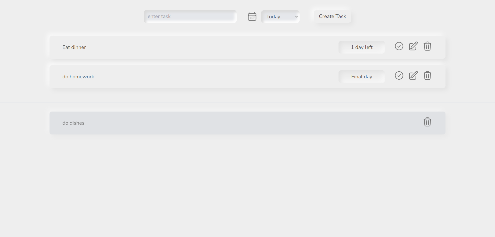

# About my To-do List
This to-do list has a simple crud functionality as well as a date setter for your task so you can choose whether to complete the 
task by today or by tomorrow. If you exceed the deadline, it will show you how long you have missed and the words will be in red.

## Future ideas
I plan to do update my date setter by using Carbon Api which is said to make it easier for me to deal with it. Currently, my date
setter is using some vanilla pre-defined PHP functions.

## License

The Laravel framework is open-sourced software licensed under the [MIT license](https://opensource.org/licenses/MIT).
